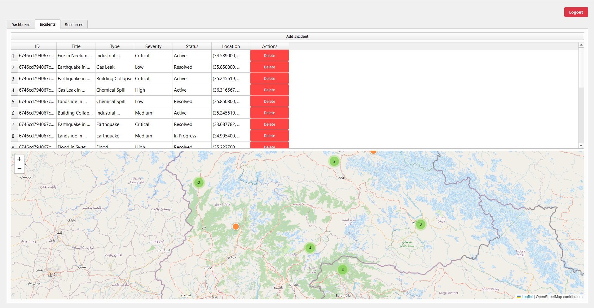

A real-time disaster response coordination platform that helps connect resources with those in need during emergencies. This open-source project aims to provide a robust solution for disaster management teams worldwide.

## 🚀 Features

- 🌍 Real-time incident tracking with interactive map visualization
- 📊 Resource allocation and tracking system
- 💬 Communication system for coordinators
- ✅ Task management for response teams
- 📱 Responsive desktop interface
- 🔒 Secure authentication system
- 📊 Data visualization and reporting

## 🛠️ Tech Stack

- **Backend:** Python 3.11
- **Database:** MongoDB
- **UI Framework:** PyQt5
- **Maps:** Interactive mapping library
- **Authentication:** JWT-based auth
- **Reporting:** ReportLab, Matplotlib

## 📋 Prerequisites

- Python 3.11 or higher
- MongoDB
- Git

## 🚀 Quick Start

1. Clone and setup:
```bash
git clone https://github.com/Razee4315/DisasterConnect.git
cd DisasterConnect
python -m venv venv
source venv/bin/activate  # On Windows: venv\Scripts\activate
pip install -r requirements.txt
```

2. Configure environment:
```bash
cp .env.example .env
# Edit .env with your configuration
```

3. Run the application:
```bash
python src/main.py
```

## 📖 Documentation

- [User Guide](docs/USER_GUIDE.md) - Detailed application usage
- [API Documentation](docs/API.md) - API endpoints and usage
- [Contributing Guidelines](CONTRIBUTING.md) - How to contribute
- [Code of Conduct](CODE_OF_CONDUCT.md) - Community guidelines
- [Security Policy](SECURITY.md) - Security and vulnerability reporting
- [Changelog](CHANGELOG.md) - Version history and changes

## 🤝 Contributing

We believe in the power of community collaboration! Whether you're fixing bugs, adding features, or improving documentation, your contributions are welcome.

1. Fork the repository
2. Create your feature branch (`git checkout -b feature/AmazingFeature`)
3. Commit your changes (`git commit -m 'Add some AmazingFeature'`)
4. Push to the branch (`git push origin feature/AmazingFeature`)
5. Open a Pull Request

See [CONTRIBUTING.md](CONTRIBUTING.md) for detailed guidelines.

## 🔒 Security

We take security seriously. If you discover any security-related issues, please follow our [Security Policy](SECURITY.md).

## 📸 Project Screenshots

Here are some snapshots of our DisasterConnect interface:





*These screenshots showcase various interfaces of our disaster response coordination platform.*

## 💬 Community and Support

- 📫 Contact: saqlainrazee@gmail.com
- 🐛 [Report bugs](https://github.com/Razee4315/DisasterConnect/issues)
- 💡 [Request features](https://github.com/Razee4315/DisasterConnect/issues)
- 👥 [Discussions](https://github.com/Razee4315/DisasterConnect/discussions)

## 📄 License

This project is licensed under the MIT License - see the [LICENSE](LICENSE) file for details.

## 👨‍💻 Author

- **Saqlain Razee** - [Razee4315](https://github.com/Razee4315)

---
⭐ Star this repository if you find it helpful!
