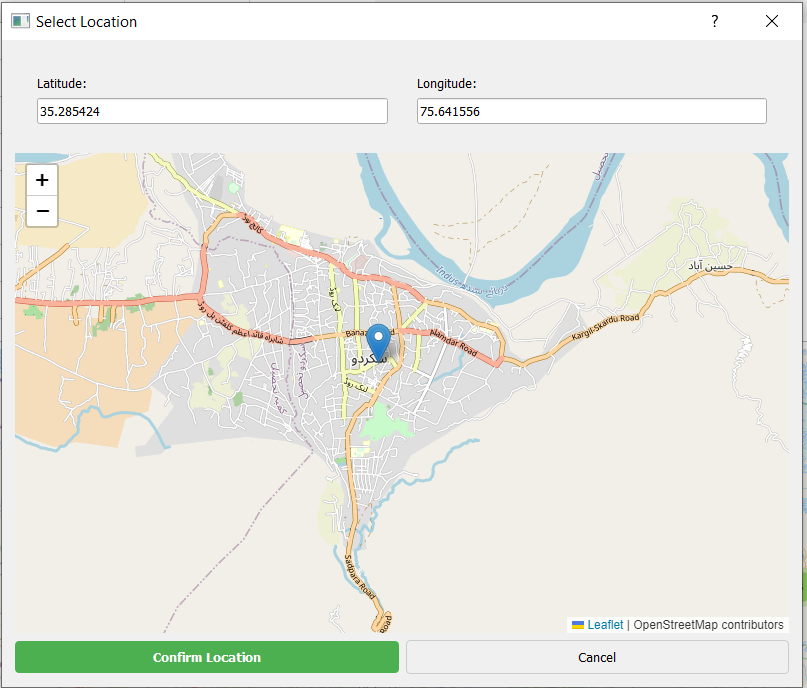

A real-time disaster response coordination platform that helps connect resources with those in need during emergencies. This open-source project aims to provide a robust solution for disaster management teams worldwide.

## 🚀 Features

- 🌍 Real-time incident tracking with interactive map visualization
- 📊 Resource allocation and tracking system
- 💬 Communication system for coordinators
- ✅ Task management for response teams
- 📱 Responsive desktop interface
- 🔒 Secure authentication system
- 📊 Data visualization and reporting

## 🛠️ Tech Stack

- **Backend:** Python 3.11
- **Database:** MongoDB
- **UI Framework:** PyQt5
- **Maps:** Interactive mapping library
- **Authentication:** JWT-based auth
- **Reporting:** ReportLab, Matplotlib

## 📋 Prerequisites

- Python 3.11 or higher
- MongoDB
- Git

## 🚀 Quick Start

1. Clone and setup:
```bash
git clone https://github.com/Razee4315/DisasterConnect.git
cd DisasterConnect
python -m venv venv
source venv/bin/activate  # On Windows: venv\Scripts\activate
pip install -r requirements.txt
```

2. Configure environment:
```bash
cp .env.example .env
# Edit .env with your configuration
```

3. Run the application:
```bash
python src/main.py
```

## 📖 Documentation

- [User Guide](docs/USER_GUIDE.md) - Detailed application usage
- [API Documentation](docs/API.md) - API endpoints and usage
- [Contributing Guidelines](CONTRIBUTING.md) - How to contribute
- [Code of Conduct](CODE_OF_CONDUCT.md) - Community guidelines
- [Security Policy](SECURITY.md) - Security and vulnerability reporting
- [Changelog](CHANGELOG.md) - Version history and changes


## 📸 Project Screenshots

Here are some snapshots of our DisasterConnect interface:





*The
