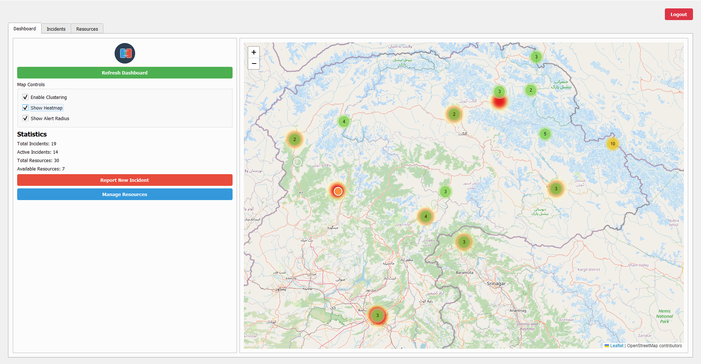
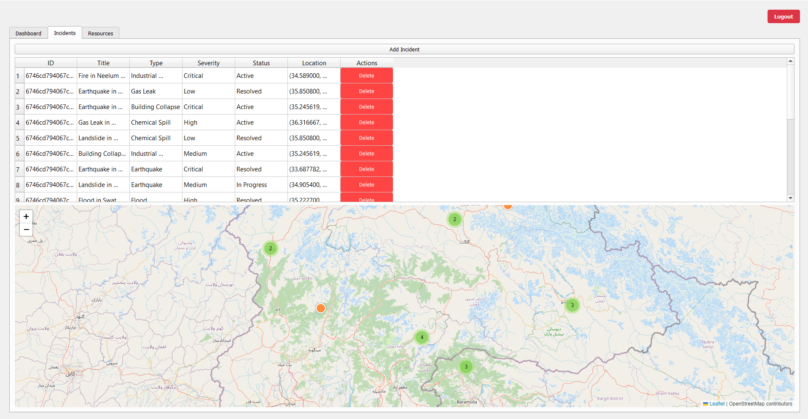
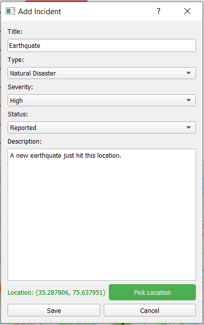
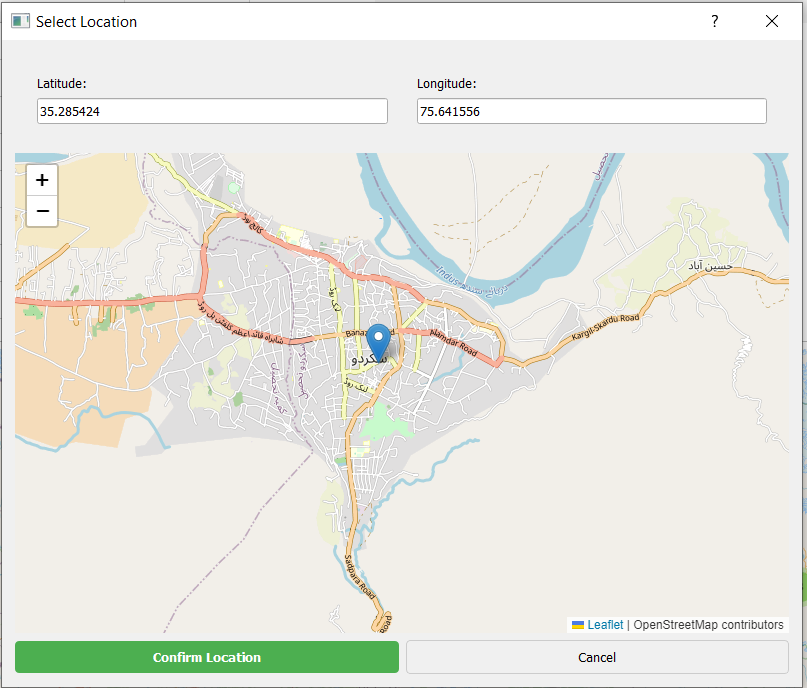

# DisasterConnect User Guide

Welcome to DisasterConnect! This guide will help you understand and use all the features of our disaster response coordination platform.

## Table of Contents
- [Getting Started](#getting-started)
- [Dashboard Overview](#dashboard-overview)
- [Incident Management](#incident-management)
- [Resource Management](#resource-management)
- [Communication System](#communication-system)
- [Reports and Analytics](#reports-and-analytics)
- [Troubleshooting](#troubleshooting)

## Getting Started

### Installation
Follow the installation steps in the [README.md](../README.md).

### First Login
1. Launch the application
2. Create an account or log in
3. Complete your profile setup

### Logging In

To access DisasterConnect, use your provided credentials at the login screen. The system supports role-based access control, ensuring users have appropriate permissions for their responsibilities.

## Dashboard Overview

The dashboard provides a comprehensive view of current situations, including:
- Active incidents
- Available resources
- Recent updates
- Key metrics and statistics

### Navigation
- Use the sidebar menu to access different sections
- Quick action buttons for common tasks
- Real-time notifications area

## Incident Management

### Creating an Incident
1. Click "New Incident"
2. Fill in:
   - Incident title
   - Location
   - Severity level
   - Description
   - Required resources

### Updating Incidents
- Edit incident details
- Update status
- Add notes
- Assign resources

### Incident Status Tracking
- Monitor progress
- View timeline
- Check resource allocation

## Managing Incidents

The incident management interface allows you to:
- Create new incident reports
- Update incident status
- Assign priority levels
- Track response progress
- Add comments and updates

## Resource Management

### Adding Resources
1. Go to Resources tab
2. Click "Add New"
3. Enter:
   - Resource type
   - Quantity
   - Location
   - Status
   - Specifications

### Resource Allocation
- Assign to incidents
- Track usage
- Monitor availability
- Schedule maintenance

## Resource Management

Efficiently manage and track resources:
- View available resources
- Allocate resources to incidents
- Track resource deployment
- Monitor resource status
- Generate resource reports

## Map Visualization

The interactive map provides:
- Real-time incident locations
- Resource distribution visualization
- Geographic analysis tools
- Route planning capabilities
- Area impact assessment

## Communication System

### Sending Messages
- Direct messaging
- Team broadcasts
- Status updates
- Emergency alerts

### Communication Channels
- Team chat
- Incident-specific channels
- Resource coordination
- Emergency broadcast

## Communication System

Stay connected with team members:
- Real-time messaging
- Team coordination
- File sharing
- Status updates
- Alert notifications

## Reports and Analytics

### Generating Reports
1. Select report type
2. Choose date range
3. Select metrics
4. Generate and export

### Available Reports
- Incident summary
- Resource utilization
- Response time analytics
- Team performance

## Analytics and Reporting

Generate insights with our analytics tools:
- Custom report generation
- Data visualization
- Trend analysis
- Performance metrics
- Response time analytics

## Troubleshooting

### Common Issues
- Login problems
- Data sync issues
- Map display problems
- Resource tracking errors

### Support
If you encounter any issues:
1. Check our [FAQ](FAQ.md)
2. Contact support: saqlainrazee@gmail.com
3. Submit an issue on GitHub

## Tips and Best Practices

1. Regular Updates
   - Keep the application updated
   - Check for new features
   - Review documentation updates

2. Data Management
   - Regular backups
   - Clean old records
   - Update resource status

3. Team Coordination
   - Clear communication
   - Regular status updates
   - Proper handover procedures

## Keyboard Shortcuts

| Action | Shortcut |
|--------|----------|
| New Incident | Ctrl+N |
| Save | Ctrl+S |
| Refresh | F5 |
| Search | Ctrl+F |
| Help | F1 |

## Additional Resources

- [API Documentation](API.md)
- [Video Tutorials](https://github.com/Razee4315/DisasterConnect/wiki/Tutorials)
- [Community Forums](https://github.com/Razee4315/DisasterConnect/discussions)

---

For technical support or feature requests, please visit our [GitHub repository](https://github.com/Razee4315/DisasterConnect).
